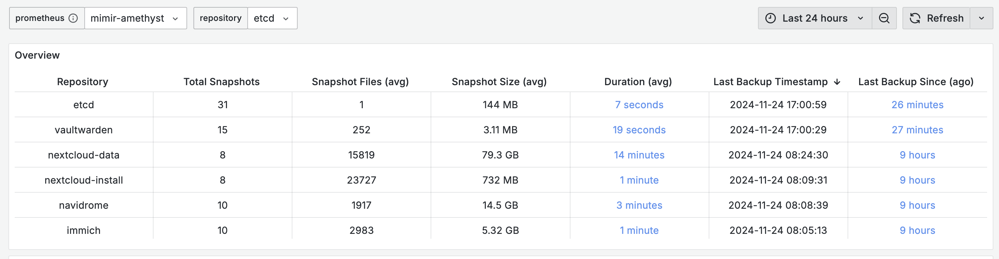

<div align="center">

# Rustic-exporter

... _progressing slowly with [Look at Yourself](https://www.youtube.com/watch?v=tcq6qZOE03c)_ 🎧

[](https://codecov.io/gh/timtorChen/rustic-exporter)
[](https://github.com/timtorChen/rustic-exporter/releases/latest)
[](https://github.com/timtorChen/rustic-exporter/pkgs/container/rustic-exporter)

</div>

---

⚠️ This project is still under development; use it with caution.

Prometheus exporter for rustic/restic backup.



### Requirements

The backup client should use `restic >= v0.17`, or metrics like `rustic_snapshot_size_bytes` will be dropped.

### Usage

#### Command line

```
Usage: rustic-exporter [OPTIONS] --config <CONFIG>

Options:
      --interval <INTERVAL>  Frequency of metrics collection in seconds [default: 300]
      --config <CONFIG>      Path to the configuration file
      --host <HOST>          Server host [default: 0.0.0.0]
      --port <PORT>          Server port [default: 8080]
  -h, --help                 Print help
  -V, --version              Print version
```

#### Configuration file

The configuration file is in TOML format, and follows the rustic [supported services](https://rustic.cli.rs/docs/commands/init/services.html).

```toml
# Local
[[backup]]
  repository = "./local"
  password = "test"
  [backup.options]


# Opendal
## S3 backend
[[backup]]
  repository = "opendal:s3"
  password = "test"
  [backup.options]
    ## set opendal S3 backend configuration in the form of key-value
    ## https://opendal.apache.org/docs/rust/opendal/services/struct.S3.html#configuration
    endpoint = "https://s3.west-2.amazonaws.com"
    access_key_id = "access-key-id"
    secret_access_key = "secret-access-key"
    bucket = "bucket-name"
    root = "/"
    region = "auto"

## Google Drive backend
[[backup]]
  repository = "opendal:gdrive"
  password = "test"
  [backup.options]
    ## set opendal GoogleDrive backend configuration
    ## https://opendal.apache.org/docs/rust/opendal/services/struct.Gdrive.html
    access_token = "access-token"
    refresh_token = "refresh-token"
    client_id = "client-id"
    client_secret = "client-secret"
```
