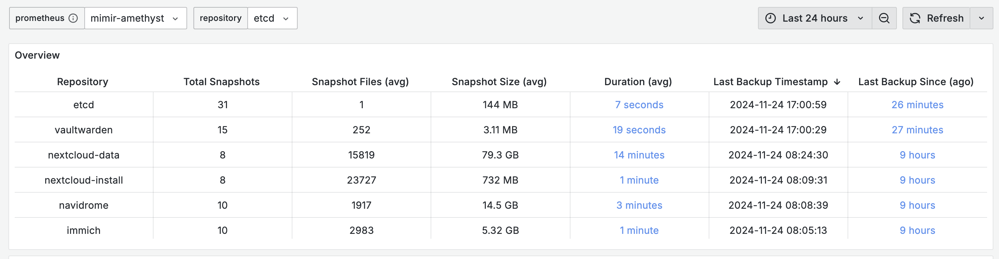

<div align="center">

# Rustic-exporter

... _progressing slowly with [Look at Yourself](https://www.youtube.com/watch?v=tcq6qZOE03c)_ 🎧

[](https://codecov.io/gh/timtorChen/rustic-exporter)
[](https://github.com/timtorChen/rustic-exporter/releases/latest)
[](https://github.com/timtorChen/rustic-exporter/pkgs/container/rustic-exporter)

</div>

---

⚠️ This project is still under development; use it with caution.

Prometheus exporter for rustic/restic backup.



### Background

Originally I would like to craft a restic-exporter supporting multiple backup repositories because of the [issue](https://github.com/ngosang/restic-exporter/issues/26#issuecomment-1915364225). After checking the code, I found restic do not separate its library from the CLI. This forces downstream user to rely on subprocess binary calls, which causes additional maintaince overhead. So, I switched gears to rustic, and started this project.

### Requirements

The backup client should use `restic >= v0.17`, or metrics like `rustic_snapshot_size_bytes` will be dropped.

### Docker Images

Two image variants are available:

- **Distroless** (default): `ghcr.io/timtorchen/rustic-exporter:latest`
- **Alpine**: `ghcr.io/timtorchen/rustic-exporter:latest-alpine`
  - Includes openssh-client for SSH-based remote repositories

Both variants support `linux/amd64` and `linux/arm64` platforms.

### Usage

#### Command line

```
Usage: rustic-exporter [OPTIONS] --config <CONFIG>

Options:
  -i, --interval <INTERVAL>    Metrics collection frequency in seconds [default: 300]
      --log-level <LOG_LEVEL>  Log level: debug, info, warn, error [default: info]
  -v, --verbose                Show logs of all dependents
  -c, --config <CONFIG>        Path to the configuration file
      --host <HOST>            Server host [default: 0.0.0.0]
      --port <PORT>            Server port [default: 8080]
  -h, --help                   Print help
  -V, --version                Print version
```

#### Configuration file

The configuration file is in TOML format, and follows the rustic [supported services](https://rustic.cli.rs/docs/commands/init/services.html). You can also interpolate
environment variables in the configuration file using a `${VARIABLE}` syntax. They are interpolated and replaced into the configuration file at runtime.

```toml
# Local backend
[[backup]]
  repository = "/local-path/to/backup"
  password = "test"
  [backup.options]

# OpenDAL backend for AWS S3
[[backup]]
  repository = "opendal:s3"
  password_file = "/path/to/password/file"
  [backup.options]
    ## set OpenDAL AWS S3 service configurations in the form of key-value
    ## https://opendal.apache.org/docs/rust/opendal/services/struct.S3.html#configuration
    endpoint = "https://s3.west-2.amazonaws.com"
    access_key_id = "${ACCESS_KEY_ID}"
    secret_access_key = "${SECRET_ACCESS_KEY}"
    bucket = "bucket-name"
    root = "/"
    region = "auto"

# OpenDAL backend for Google Cloud Storage
[[backup]]
  repository = "opendal:gcs"
  password = "test"
  [backup.options]
    ## https://opendal.apache.org/docs/rust/opendal/services/struct.Gcs.html#configuration
    endpoint = "https://storage.googleapis.com"
    credential = "base64-encoded-json"
    bucket = "bucket-name"
    root = "/"

# OpenDAL backend for Azure Blob Storage
[[backup]]
  repository = "opendal:azblob"
  password = "test"
  [backup.options]
    ## https://opendal.apache.org/docs/rust/opendal/services/struct.Azblob.html#configuration
    endpoint = "https://account-name.blob.core.windows.net"
    account_name = "account-name"
    account_key = "account-key"
    container = "container-name"
    root = "/"

# OpenDAL backend for Google Drive
[[backup]]
  repository = "opendal:gdrive"
  password = "test"
  [backup.options]
    ## https://opendal.apache.org/docs/rust/opendal/services/struct.Gdrive.html#configuration
    access_token = "access-token"
    root = "/"

# OpenDAL backend for SFTP
[[backup]]
  repository = "opendal:sftp"
  password = "test"
  [backup.options]
    ## https://opendal.apache.org/docs/rust/opendal/services/struct.Sftp.html#configuration
    endpoint = "ssh://user@hostname:port"
    root = "/remote-path/to/backup"
```
